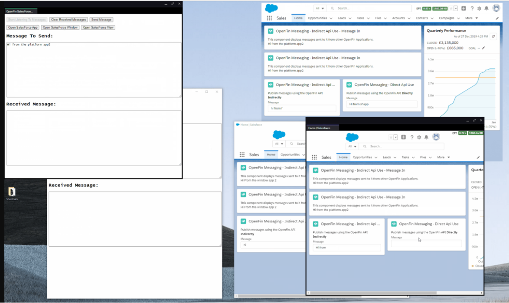

# OpenFin SalesForce Example

This repo is purely intended as an example for experimentation.

## What does the example show?

The example shows:

- An OpenFin Window based application
- An OpenFin Platform based application

### Window Based Application

This application can launch:

- A second OpenFin Application that contains a SalesForce Site that is OpenFin enabled and has lightning components that can communicate with OpenFin.
- A new window that is part of the application and loads in a SalesForce site that is OpenFin enabled (the same site used by the SalesForce app).

### Platform Based Application

The application hosts the same app.html page as the window based application but the page is hosted in a view/tab instead of being the whole page.

This application can launch:

- A second OpenFin Application that contains a SalesForce Site that is OpenFin enabled and has lightning components that can communicate with OpenFin.
- A new platform window that is part of the application and contains a view that loads in a SalesForce site that is OpenFin enabled.
- A view into the platform window where the button is clicked. This view points to the same SalesForce site as the others.

### Common across apps

The OpenFin application can send messages to the SalesForce app and to the SalesForce windows that the application has opened. Messages do not go between the Window and Platform app (as we restrict the destination).

The OpenFin can also receive messages from the SalesForce app or SalesForce windows launched from the application.

### Enabling OpenFin Support For SalesForce

#### The preload scripts

This is just an example. The preload directory contains three scripts that can be preloaded into a window/application that is hosting SalesForce (you can pick one or all three):

- salesforce-openfin-api.js - This adds support for requesting the OpenFin api by sending and listening to a custom event. This is just an example and as such there is no guarantee that this approach will work with future versions of SalesForce.

  An example of a lightning component making use of this can be found in lwc/openfinmessaging/openfinmessaging.js

The code snippet looks like this:

```javascript
window.addEventListener("openfin-api-response", (e) => {
  if (e.detail.fin !== undefined && e.detail.fin.length === 1) {
    this.finApi = e.detail.fin[0];
    this.finUUID = this.finApi.Application.getCurrentSync().identity.uuid;
  }
});

let apiRequest = new CustomEvent("openfin-api-request", {
  bubbles: false
});

window.dispatchEvent(apiRequest);
```

- salesforce-openfin-iab.js - This adds support for receiving messages from the message bus and passing them to a lightning component through a custom event. It also enables messages to the message bus from a lightning component through the use of custom events.
  An example lightning component can be found in: lwc/receiveopenfinmessage/receiveopenfinmessage.js and lwc/sendopenfinmessage/sendopenfinmessage.js

The code snippet to listen to messages coming in looks like this:

```javascript
window.addEventListener("openfin-inbox", (e) => {
  if (e.detail.message !== undefined) {
    this.message = e.detail.message;
  }
});
```

The code snippet to send messages to the message bus looks like this:

```javascript
window.dispatchEvent(
  new CustomEvent("openfin-outbox", {
    bubbles: false,
    detail: { message: this.message }
  })
);

// to specify to send instead of publish specify the uuid of the app you wish to send a message to. To specify a custom topic you can pass a topic and it will be used instead:
window.dispatchEvent(
  new CustomEvent("openfin-outbox", {
    bubbles: false,
    detail: {
      message: this.message,
      uuid: "target-app-id-if-you-want-to-send-instead-of-publish",
      topic: "if you wish to publish or send to a specific topic"
    }
  })
);
```

- salesforce-openfin-window.js - this is used to add some styling when SalesForce is launched inside of a window with no frame (it adds the relevant style to mark the logo and header as something that can be dragged). It isn't needed if you are showing a frame or launching it as part of an OpenFin platform window/view.

#### Assigning the preload scripts

##### To an app

To assign the preload scripts to an app (as seen in config/salesforce.openfin.json) you would add a preloadScripts property to the "startup_app":

```javascript
"preloadScripts": [
      {
        "url": "https://brmtx.csb.app/preload/salesforce-openfin-window.js"
      },
      {
        "url": "https://brmtx.csb.app/preload/salesforce-openfin-api.js"
      },
      {
        "url": "https://brmtx.csb.app/preload/salesforce-openfin-iab.js"
      }
    ]
  }
```

##### To an OpenFin Window

To assign the preload scripts to an OpenFin window (an example can be seen in js/open.js) you would pass the preload scripts as part of the window options:

```javascript
const name = "salesforce";
const preloadScripts = [
    {
      url: "https://brmtx.csb.app/preload/salesforce-openfin-api.js"
    },
    {
      url: "https://brmtx.csb.app/preload/salesforce-openfin-iab.js"
    }
];
const winOption = {
        name,
        url,
        preloadScripts,
        defaultWidth: 800,
        defaultHeight: 800,
        frame: true,
        autoShow: true
      };

      window.fin.Window.create(winOption)
        .then(() => console.log("Window is created"))
        .catch((err) => console.log(err));
    };
```

##### To an OpenFin Platform Window (a new window with a view)

To assign the preload scripts to an OpenFin Platform window (an example can be seen in js/open.js) you would pass the preload scripts as part of the view options:

```javascript
const name = "salesforce";
const preloadScripts = [
  {
    url: "https://brmtx.csb.app/preload/salesforce-openfin-api.js"
  },
  {
    url: "https://brmtx.csb.app/preload/salesforce-openfin-iab.js"
  }
];
const platform = window.fin.Platform.getCurrentSync();
platform
  .createView({
    name,
    url,
    preloadScripts
  })
  .then(console.log)
  .catch((err) => console.log(err));
```

##### To an OpenFin Platform View inside of the current Window

To assign the preload scripts to an OpenFin Platform view (an example can be seen in js/open.js) you would pass the preload scripts as part of the view options:

```javascript
const name = "salesforce";
const preloadScripts = [
  {
    url: "https://brmtx.csb.app/preload/salesforce-openfin-api.js"
  },
  {
    url: "https://brmtx.csb.app/preload/salesforce-openfin-iab.js"
  }
];
const windowIdentity = (await window.fin.me.getCurrentWindow()).identity;
const platform = window.fin.Platform.getCurrentSync();
platform
  .createView(
    {
      name,
      url,
      preloadScripts
    },
    windowIdentity
  )
  .then(console.log)
  .catch((err) => console.log(err));
```

### Launching the example (On codesandbox)

<a href="https://codesandbox.io/s/openfin-salesforce-example-brmtx?file=/README.md" target="_blank">Open Codesandbox</a>

<a href="https://brmtx.csb.app/" target="_blank">Open Codesandbox Preview (No code just the rendered page)</a>

CodeSandbox will show the a preview of the main page and allow you to navigate the code (like you can in github).

You can launch the app but you will not be able to log into the Salesforce site so an example is shown here:



<a href="https://johnman.github.io/openfin-salesforce-example/SalesForce-OpenFin-Demo.gif" target="_blank">Open animated gif in a new window</a>

### Experimenting yourself

You can take snippets of this code and put it in your own experiment or you can clone this repo or fork it on codesandbox.

#### Things to change

If you have a copy then you would need to change a few things:

- The SalesForce Url (this is specified in config/salesforce.openfin.json, js/open.js)
- You will need to create some lightning components for your own site (you can see basic examples in the lwc folder).
- You will need to replace all instances of the codesandbox url: https://brmtx.csb.app/ with your own host (this exists in config/platform.openfin.json, config/window.openfin.json and salesforce.openfin.json).
- Update the fins links in index.html to launch your test app (this isn't needed if you are using the openfin cli to launch the app instead).
- The uuids in (this exists in config/platform.openfin.json, config/window.openfin.json and salesforce.openfin.json) and reach out to OpenFin for a trial license or use your own if you have one.
- If you change the SalesForce App uuid in config/salesforce.openfin.json then you will need to update salesForceAppId in js/listenAndSend.js to match.

To change the topic names (as this is just an experiment) you can find them specificed in:

- js/listenAndSend.js
- lwc/openfinmessaging/openfinmessaging.js
- preload/salesforce-openfin-iab.js

When building your experimental app consider creating an abstraction class/service that exposes an api for your lightning components to use. You can then swap out the implementation with different approaches without having to change your components.

Please remember this is demo/experimental code and please treat it as such. For more information about OpenFin and it's APIs please visit: <a href="https://developers.openfin.co/docs/openfin-os" target="_blank">the developer section of the OpenFin website</a>.
